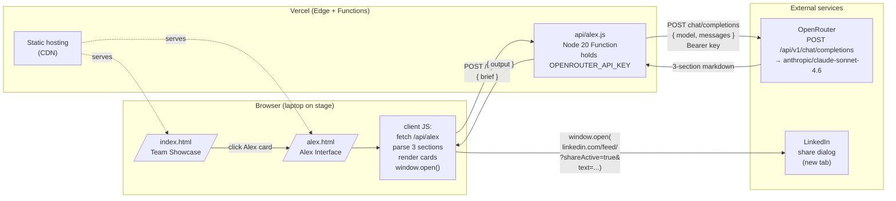

# System Architecture — PeopleOS Hackathon Demo

Three-tier minimal: static frontend → serverless proxy → LLM provider. One additional client-side outbound flow (LinkedIn share dialog).

---

## Component diagram



---

## Components

### Browser (vanilla JS)

- **Responsibilities**: render UI, manage page state machine (idle → submitting → result / error), parse 3-section response, build LinkedIn share URL, open it.
- **No build step required** — but optional Vite dev server for fast reload during development. Production deploy is just static files; Vercel serves them from its global CDN.
- **No framework, no router, no state library.** Two HTML files, two JS modules (`team.js` is minimal, `alex.js` is the meat).
- **Why so plain**: avoids deploy-time surprises during the hackathon, no node_modules to debug at 15:30 on demo day.

### Vercel — static hosting

- Serves `index.html`, `alex.html`, CSS, JS files from the CDN.
- Zero config beyond `vercel.json` rewrite for `/alex` (if needed; Vercel may auto-resolve `alex.html`).

### Vercel — serverless function `api/alex.js`

- **Runtime**: Node 20 (Vercel default).
- **Why on the server**: the OpenRouter API key MUST NOT ship to the browser. Server-side is the only place it can live.
- **Endpoint**: `POST /api/alex` with body `{ brief: string }`.
- **What it does**:
  1. Read `brief` from body. Validate: 20 ≤ length ≤ 2,000.
  2. Read `OPENROUTER_API_KEY` from `process.env`.
  3. POST to `https://openrouter.ai/api/v1/chat/completions`:
     ```json
     {
       "model": "anthropic/claude-sonnet-4.6",
       "messages": [
         { "role": "system", "content": ALEX_SYSTEM_PROMPT },
         { "role": "user", "content": brief }
       ],
       "temperature": 0.7,
       "max_tokens": 2000
     }
     ```
     Headers: `Authorization: Bearer <key>`, `HTTP-Referer: <vercel-url>`, `X-Title: PeopleOS · Alex`.
  4. Return `{ output: response.choices[0].message.content }`.
- **Timeout**: 30 seconds (Vercel default for Hobby plan; sufficient for Sonnet 4.6).
- **No streaming in Phase 1**. Plain JSON response. Streaming is Phase 2+ if there's time.

### OpenRouter

- Routes to `anthropic/claude-sonnet-4.6`. OpenAI-compatible API surface.
- Single API key authenticates the request.
- We pay per-token; budget is hackathon-scale (single-digit dollars even for many rehearsals).

### LinkedIn share dialog

- Not an API integration. Just `window.open()` to a URL that pre-populates the share composer.
- URL format: `https://www.linkedin.com/feed/?shareActive=true&text=<encoded-ad-text>`.
- Pitcher must be logged into LinkedIn in the same browser session. (Pre-demo checklist item.)

---

## External services table

| Service | Purpose | Provider | Auth | Risk | Failure mode | Mitigation |
| --- | --- | --- | --- | --- | --- | --- |
| **Vercel hosting + functions** | Serve static assets + run `/api/alex` | Vercel | none for static; server-side env var | Low — Vercel uptime is excellent | Vercel outage = total demo failure | Have a local backup: `python -m http.server` + local API key in a backup `.env.local` (Phase 2 polish). For Phase 1 demo: trust Vercel. |
| **OpenRouter** | Proxy to Claude Sonnet 4.6 | OpenRouter (3rd party) | API key in Vercel env var | Medium — extra hop between us and Anthropic | OpenRouter outage OR rate limit OR key revoked → 5xx response | Client shows graceful "having a moment" error + retry button. Pitcher retries; usually succeeds. |
| **Anthropic Sonnet 4.6** (via OpenRouter) | Generate the 3-section output | Anthropic | (transitive via OpenRouter) | Low | Slow response (>10s) → looks bad on stage | Loading state has rotating copy ("Reviewing the brief…", "Drafting the advert…") so silence is hidden. 30s timeout in the function. |
| **LinkedIn share** | The hero moment — post the ad live | LinkedIn | none (relies on pitcher's logged-in session) | Medium — depends on the share URL still working | URL format breaks, or pitcher logged out, or LinkedIn blocks the popup | Pre-demo checklist: test the URL 3 times. Pitcher must be logged in. Fallback: "Copy" button on the LinkedIn ad card → pitcher pastes manually into a LinkedIn tab. |
| **Google Fonts** (DM Sans, Syne, DM Mono) | Typography | Google | none | Low | Font CDN slow → FOUT (flash of unstyled text) | Use `display=swap` in the Google Fonts URL (already in `Docs/peopleos-alex-demo.html`). System fallback fonts kick in instantly. |

---

## Data flow — happy path

```
1. Pitcher loads /            → Vercel CDN serves index.html       (~50ms)
2. Pitcher clicks Alex card    → Browser navigates to /alex
3. Vercel CDN serves alex.html (~50ms)
4. Pitcher pastes brief, hits Cmd+Enter
5. Browser: state → submitting; POST /api/alex { brief }            (~5ms RTT)
6. Vercel function reads OPENROUTER_API_KEY
7. Function POSTs to OpenRouter                                     (~3–6s for Sonnet 4.6 on a 1,800-char output)
8. OpenRouter forwards to Anthropic, streams response back to function
9. Function returns { output } JSON to browser                      (~50ms)
10. Browser parses 3 sections, renders 3 cards
11. Smooth-scrolls to first card
12. Pitcher clicks "Post to LinkedIn"
13. Browser: window.open(...)
14. LinkedIn share dialog opens with text pre-filled
15. Pitcher clicks "Post" in LinkedIn — done.

Total: brief → output rendered = ~4–7 seconds.
       click "Post" → LinkedIn open = instant.
```

---

## Failure modes & responses

| Failure | Detection | User-facing behaviour |
| --- | --- | --- |
| OpenRouter 5xx | `response.ok === false` in function | Function returns 502. Browser shows warning panel + "Try again" CTA. |
| OpenRouter 429 (rate limit) | Status code 429 | Same as above. Hackathon volume should not trigger this, but possible if rehearsals are tight. |
| Network failure (browser → Vercel) | `fetch` throws | Browser shows warning panel. |
| Vercel function timeout (>30s) | Function never returns; browser gets 504 | Browser warning panel. Likely indicates Sonnet is stuck — retry. |
| Malformed model output (no `## LINKEDIN JOB ADVERT` header) | Section parser returns empty | Render full raw response in a single fallback card with "Alex's output didn't parse cleanly — here it is raw" disclosure. Demo continues. |
| LinkedIn share URL doesn't pre-fill | Pitcher sees empty composer | Pitcher hits "Copy" button on ad card, pastes manually. Same outcome, ~3 extra seconds. |
| Pitcher not logged into LinkedIn | LinkedIn shows login form instead of composer | Pre-demo checklist mitigates. If it happens live: pitcher logs in, then re-clicks "Post". |
| Vercel deploy unstable | Production URL 5xx | Pre-demo checklist: test the URL 3 times in 30 min before demo. If unstable: redeploy. As an emergency fallback, the production deploy URL is bookmarked AND a local backup `python -m http.server 3000` setup is documented. |

---

## Security & secrets

- **Single secret**: `OPENROUTER_API_KEY` — stored in Vercel environment variables (Production + Preview + Development).
- **Never** committed to git. The `.env.example` in the repo lists the variable name without a value.
- **Browser never sees the key.** The `/api/alex` endpoint is the only place that holds it.
- **No CORS issue**: browser and function are same-origin (both on the Vercel deploy URL).
- **Input validation in function**: reject briefs <20 chars (prevents accidental empty submits) or >2,000 chars (prevents abuse / accidental paste of a whole doc).
- **No rate limiting in Phase 1.** Hackathon scope — no public traffic to defend against. If we hit OpenRouter rate limits during rehearsals, we add a simple in-memory throttle.
- **No PII storage**. Briefs aren't stored anywhere — neither in Vercel logs (we don't log request bodies) nor in OpenRouter (we don't enable persistence).
- **Vercel logs**: function logs may capture timing and status codes. Don't log the brief content. Don't log the model output.

---

## Top architecture decisions surfaced

1. **One serverless function, not a full backend.** A single `api/alex.js` is the entire backend. No Express, no DB, no auth middleware. Faster to ship, harder to break.
2. **OpenRouter as proxy instead of Anthropic direct.** User explicitly chose this. Trade-off: one extra hop (slight latency increase, ~50–100ms) for the ability to swap models without changing client code. Worth it for hackathon flexibility.
3. **Static HTML over framework.** Even Vite is optional. Production = three flat files. Means: zero build-time bugs on demo day. The only thing that can fail is the function or the LLM.
4. **Stateless everywhere.** No DB, no session, no cache. Every brief is a fresh request. Simplifies the failure surface to "the network call works or doesn't".
5. **LinkedIn = `window.open()`, not API.** No OAuth, no LinkedIn dev app, no review process. Trade-off: pitcher must be logged in, and the URL format could theoretically break — both mitigated by pre-demo checks.
6. **30s function timeout is enough.** Sonnet 4.6 outputs ~2,000 chars in 4–7s typical. 30s is a generous buffer. Vercel Hobby tier allows up to 60s; we don't need it.
7. **No streaming in Phase 1.** Streaming requires either server-sent events from the function (more complex) or fetch + ReadableStream parsing. Plain JSON `{ output }` is sufficient; the "Alex is on it…" panel hides the wait.
8. **Fallback rendering for malformed model output.** This is the single highest-value defensive choice. Without it, one bad model response = dead demo. With it, demo always shows *something*.
