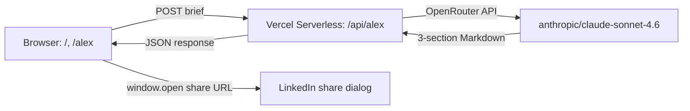

# PeopleOS

> AI-powered HR platform with 8 named AI HR managers. Hackathon demo: Alex Chen, Talent Acquisition Manager, writes a full job description + LinkedIn ad + interview scorecard from a one-paragraph hiring brief — and posts the ad to LinkedIn live on stage.

## Vision

Every HR manager has spent four hours writing a job description this month. PeopleOS gives them an AI team that does it in four seconds. Eight specialised agents — one per HR function — that feel like delegating to a real person, not configuring a tool.

The Berlin 2026 demo introduces **Alex Chen** (Agent 1 of 8). The pitcher hands Alex a one-paragraph brief, Alex returns a LinkedIn-ready job advert + full job spec + interview scorecard, and the pitcher posts the ad to LinkedIn live from the stage. From brief to live job post in 45 seconds.

## Users

| Persona | Description | Key needs |
| ------- | ----------- | --------- |
| Hackathon Pitcher (James) | Demos PeopleOS on stage in Berlin 2026. Needs a flawless, low-latency demo. | Zero-friction input → fast, formatted output → frictionless LinkedIn post. No spinners-of-death. |
| Audience (HR managers, founders, investors) | Watching the demo. Will judge the product on perceived realism + speed. | Output must look like a senior recruiter wrote it, not a generic AI template. |
| Future buyer (HR manager at a 20–200 person company) | Post-hackathon — this is the actual customer. Not directly served by this demo but the demo shapes their first impression. | Trust that the agent's output is shippable without heavy editing. |

## Features (v1 scope — for the hackathon demo)

| # | Feature | Priority | Description |
| --- | --- | --- | --- |
| 1 | Team Showcase page | P0 | Landing page with all 8 AI HR agents as cards. 7 are "Coming Soon", Alex's card is the only one that opens a working agent. Establishes the product narrative. |
| 2 | Alex chat / brief interface | P0 | Single textarea, large, with placeholder "Brief Alex on the role you need to fill…" and a "Get to work, Alex →" submit button. Loading state: "Alex is on it…" |
| 3 | OpenRouter API integration via Vercel serverless function | P0 | `/api/alex` proxies the brief to OpenRouter (`anthropic/claude-sonnet-4.6`) with Alex's system prompt. Key lives in Vercel env vars — never in the browser. |
| 4 | Three-section structured output (LinkedIn ad, Job Spec, Interview Scorecard) | P0 | Alex's response is parsed into the three Markdown sections and rendered as three distinct cards. LinkedIn ad is the gold-bordered "hero" card. |
| 5 | Post-to-LinkedIn button (the magic moment) | P0 | Below the LinkedIn ad card. Click → `window.open('https://www.linkedin.com/feed/?shareActive=true&text=' + encodeURIComponent(text), '_blank')`. LinkedIn opens with the ad pre-populated. Pitcher hits "Post". Live. |
| 6 | Copy buttons on each output | P1 | Judges will want to copy the job spec. One button per section. Clipboard API. |
| 7 | Brand-consistent dark UI (PeopleOS Brand v2) | P0 | Dark-first, gold/blue accents, DM Sans + Syne + DM Mono. CSS variables from `Docs/brand-guidelines.md`. |
| 8 | Pre-typed brief auto-paste shortcut | P1 | Hidden keyboard shortcut (e.g. Cmd+Shift+P) pastes the rehearsed brief into the textarea. Pitcher doesn't type live — seconds matter. |
| 9 | Loading state with personality | P1 | "Alex is reviewing the brief…" with subtle animation. Suspense = part of the demo. |
| 10 | Error fallback that doesn't break the demo | P0 | If OpenRouter call fails: show a calm "Alex is having a moment — try again" message, log to console. Never a 500-page. |

## User Stories

### Story: The Pitcher's Live Demo (60 seconds total)

**As the** pitcher James, **I want to** brief Alex with a single paragraph, see the three outputs appear within ~5 seconds, and post the LinkedIn ad live, **so that** the audience experiences the "delegate to a real AI team member" moment instead of watching me click through a UI.

**Acceptance criteria:**

- [ ] Team Showcase page loads in <1s.
- [ ] Clicking Alex's card opens the Alex interface in same tab.
- [ ] Submit brief → first output bytes visible within 4s; full output by 8s.
- [ ] LinkedIn ad renders in the hero (gold-bordered) card.
- [ ] "Post to LinkedIn" button opens LinkedIn share dialog in new tab with ad text pre-populated and under 2,000 chars.
- [ ] Demo runs end-to-end three times in a row without a single failure during the pre-demo rehearsal.

### Story: Pre-Demo Rehearsal

**As the** pitcher, **I want to** set the OpenRouter API key once (via Vercel dashboard) and have the deploy URL stable, **so that** the day-of-demo has zero configuration steps.

**Acceptance criteria:**

- [ ] `OPENROUTER_API_KEY` is set as a Vercel environment variable.
- [ ] Production URL is bookmarked on the demo laptop.
- [ ] No `.env` file in the repo; key is never in client bundle.

## Wireframes

### Team Showcase (`/`)

```
+----------------------------------------------------------+
|  PEOPLEOS · YOUR AI HR TEAM                              |
+----------------------------------------------------------+
|                                                          |
|  Eight AI managers. All specialisms covered.             |
|                                                          |
|  +------------+  +------------+  +------------+          |
|  |    AX      |  |    JS      |  |    RT      |          |
|  |  Alex Chen |  | Jordan S.  |  | Rae Taylor |          |
|  |  Talent    |  | Onboarding |  | Performance|          |
|  |  [ACTIVE]  |  | [SOON]     |  | [SOON]     |          |
|  +------------+  +------------+  +------------+          |
|  +------------+  +------------+  +------------+          |
|  |    ...     |  |    ...     |  |    ...     |          |
|  +------------+  +------------+  +------------+          |
|                                                          |
|  (Click Alex → /alex)                                    |
+----------------------------------------------------------+
```

### Alex Interface (`/alex`)

```
+----------------------------------------------------------+
|  ← Back to team                                          |
|                                                          |
|  [AX]  Alex Chen                       ● Online          |
|        Talent Acquisition Manager                        |
+----------------------------------------------------------+
|                                                          |
|  +----------------------------------------------------+  |
|  |  Brief Alex on the role you need to fill…          |  |
|  |                                                    |  |
|  |  (large textarea, ~6 rows)                         |  |
|  +----------------------------------------------------+  |
|             [ Get to work, Alex → ]                      |
|                                                          |
|  ── outputs appear below after submit ──                 |
|                                                          |
|  ┌──── LINKEDIN JOB ADVERT (gold-bordered hero) ────┐   |
|  │  …formatted LinkedIn copy…                       │   |
|  │                          [Copy] [Post to LinkedIn]│   |
|  └──────────────────────────────────────────────────┘   |
|                                                          |
|  ┌── JOB SPECIFICATION ──┐  ┌── INTERVIEW SCORECARD ──┐ |
|  │  …internal doc…       │  │  …5 competencies, 2 Qs… │ |
|  │              [Copy]   │  │              [Copy]     │ |
|  └───────────────────────┘  └─────────────────────────┘ |
+----------------------------------------------------------+
```

## Architecture



- **Browser** (static HTML/CSS/JS, vanilla): renders Team Showcase + Alex interface. Parses three-section response. Builds LinkedIn share URL.
- **Vercel Serverless Function** `/api/alex`: receives `{ brief: string }`, calls OpenRouter with Alex's system prompt, returns the model's text. Holds the API key.
- **OpenRouter** → routes to `anthropic/claude-sonnet-4.6`.
- **LinkedIn** → `window.open()` opens the share dialog with pre-filled text. No API integration, no auth.

## Data Model

No persistent storage. Everything is stateless:

- Request: `{ brief: string }`
- Response: `{ output: string }` (the three-section Markdown blob; client parses it).

(If we later add a "history" feature, we'd add a `runs` table — but for the hackathon: no DB.)

## Stack

- **Frontend**: Plain HTML + CSS + vanilla JS. No framework. (Optional: Vite as dev server for fast reload — production build is just static files.)
- **Serverless**: Vercel Functions (Node.js runtime) — single endpoint `/api/alex.js`.
- **AI**: OpenRouter API → `anthropic/claude-sonnet-4.6`.
- **Hosting**: Vercel (static + edge functions).
- **Env**: `OPENROUTER_API_KEY` in Vercel env vars (production + preview).
- **LinkedIn**: Share URL only (no API key needed).

## Constraints

- **Hackathon deadline: today / tomorrow.** Tracer-bullet mode. Phase 1 must produce a working end-to-end demo (brief → output → LinkedIn open). Polish is Phase 2+.
- **No backend / DB.** Stateless, no auth, no user accounts.
- **API key never in browser.** Lives in Vercel env vars; called only server-side.
- **Demo must not crash.** Network failure, slow response, malformed output → graceful fallback. Pitcher should never have to apologise on stage.
- **Time-to-first-token matters more than total latency.** Streaming is nice-to-have for the "Alex is on it" feel; defer to Phase 2 if it complicates Phase 1.
- **UK English in Alex's output, £ for salary.** Pinned in the system prompt.
- **Output must be under 2,000 chars for the LinkedIn ad section.** LinkedIn limit. Enforced in the prompt + verified client-side before opening the share URL.
- **Brand fidelity is non-negotiable.** PeopleOS Brand v2 colours/fonts/components from `Docs/brand-guidelines.md`. Dark-first, gold = importance, blue = interactivity.

## Out of Scope

- The other 7 agents (Onboarding, Performance, etc.) — only Alex is functional; the rest are visual stubs ("Coming Soon").
- Auth, accounts, multi-tenant — not even considered.
- Persistence / history of past briefs.
- Streaming token-by-token UI (only if Phase 1 leaves time).
- LinkedIn API integration. We use the share URL only.
- Mobile responsiveness beyond "doesn't visibly break". The demo is on a laptop on stage.
- Real-time analytics, A/B testing, dashboards.
- Internationalisation beyond UK English for the Alex output.
